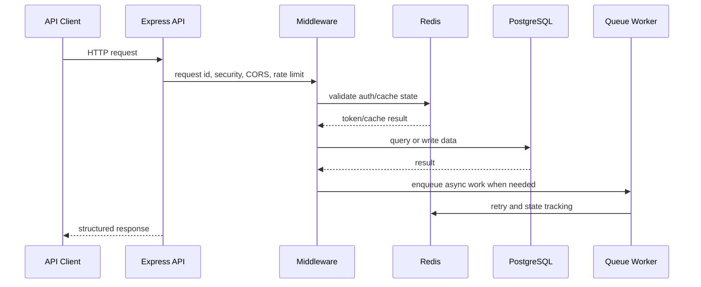
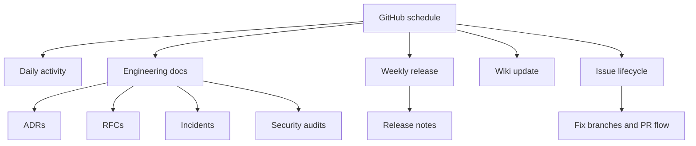

# Architecture Overview

`daily-activity` is a production-style Node.js service with a visible automation and documentation layer. The codebase combines API reliability patterns with scheduled GitHub workflows that keep engineering records current.

## Runtime Flow

## Module Boundaries

| Layer | Responsibility |
| --- | --- |
| `src/middleware` | Request safety, auth, rate limiting, error boundaries |
| `src/routes` | HTTP endpoints and request/response contract |
| `src/services` | Shared business utilities, logging, cache behavior, connection management |
| `src/cache` | Cache manager behavior and cache-specific tests |
| `src/queue` | Background processing, retry handling, queue resilience |
| `src/db` | Query analysis, migrations, index monitoring |
| `src/utils` | Pagination, retry helpers, sanitization, token utilities |
| `docs` | Engineering memory: decisions, incidents, proposals, security notes |

## Automation Layer

## Reliability Patterns

- Redis-backed auth/session validation.
- Sliding-window rate limiting.
- Cursor pagination for large datasets.
- Composite database indexes for high-traffic queries.
- Retry helpers for external calls.
- Queue processing with failure handling.
- Structured logging and request correlation.
- Health checks for load balancer and dependency visibility.

## Review Checklist

- Confirm recent Actions runs are green.
- Check that scheduled workflows still use non-destructive commits.
- Review newest generated docs for useful operational content.
- Verify `CHANGELOG.md` reflects meaningful release changes.
- Keep secrets out of code and docs.
